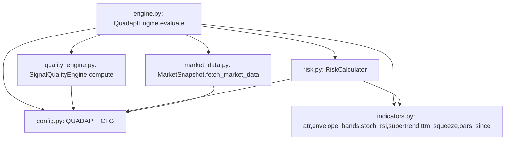

# Strategy Module Dependency Graph (graphify)
# Scope: core_backend/strategies/  |  Generated for compounding backtest loop

## Key flow (for subagents)
- `engine.evaluate()` is the SINGLE entry point that must be replayed bar-by-bar in the local FX backtester.
- It pulls: envelope signals (indicators), quality score (quality_engine), risk SL/TP (risk), all params from config.
- **No exit logic** exists — engine only emits entry signals. This is a known GAP for the compounding loop (need symmetric-exit / daily-circuit-breaker).
- `market_data.fetch_market_data()` hits Alpha Vantage (free tier, 5 calls/min) — the backtester must replace this with historical candle replay, NOT live fetch, to avoid API limits.
